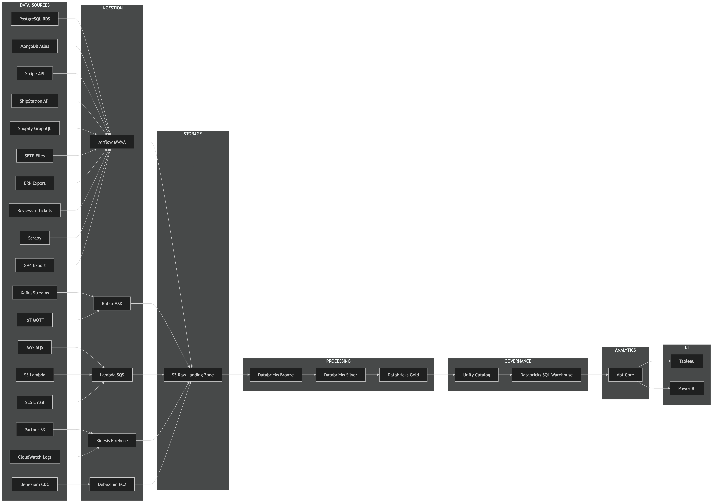

# Unified E-Commerce Data Platform

A production-grade data engineering platform built on AWS and Databricks, covering every data source type, ingestion pattern, and processing layer found in enterprise e-commerce systems.

---

## What this is

A full end-to-end data platform that ingests 18 different data sources — relational databases, NoSQL, REST APIs, GraphQL, Kafka streams, CDC, IoT sensors, file drops, web scraping, and SaaS exports — processes them through a medallion architecture (Bronze → Silver → Gold), and serves business-ready data for analytics and reporting.

Every component is real infrastructure on real cloud services. Nothing is simulated with Docker or mocked locally.

---

## Architecture



| Layer | Tool | Role |
|---|---|---|
| Sources | PostgreSQL, MongoDB, Kafka, IoT, APIs, Files, SaaS | 18 data origins |
| Ingestion | Airflow MWAA, Kafka MSK, Debezium, Lambda, Kinesis | Batch + real-time |
| Storage | AWS S3 Raw Landing Zone | Immutable, partitioned by source + date |
| Processing | Databricks + Delta Live Tables + PySpark | Bronze → Silver → Gold |
| Governance | Unity Catalog | Lineage, access, column-level security |
| Serving | Databricks SQL Warehouse | BI query engine |
| Analytics | dbt Core | Data marts, Gold transformations |
| BI | Tableau + Power BI | Dashboards, self-serve analytics |

---

## Tech Stack

| Layer | Technology |
|---|---|
| Cloud | AWS |
| Platform | Databricks |
| Storage | AWS S3 (Delta Lake) |
| Streaming | AWS MSK (Managed Kafka) |
| CDC | Debezium → MSK |
| Source DB (relational) | AWS RDS PostgreSQL |
| Source DB (NoSQL) | MongoDB Atlas |
| Processing | Databricks + PySpark |
| Stream processing | Spark Structured Streaming |
| Table format | Delta Lake |
| Pipelines | Delta Live Tables + Raw PySpark |
| Orchestration | Airflow (MWAA) + Databricks Workflows |
| Governance | Unity Catalog |
| Data quality | Great Expectations |
| Infrastructure | Terraform |
| Language | Python + PySpark + SQL |

---

## Data Sources

18 sources covering every ingestion pattern that exists in production systems — relational databases, NoSQL, REST APIs, GraphQL, real-time Kafka streams, CDC, IoT sensors, file drops, web scraping, message queues, and SaaS exports.

→ Full breakdown of every source, what it simulates, and how it connects to Bronze: [`generators/README.md`](generators/README.md)

---

## Staff-Level Standards

Three things junior engineers skip that this project does not:

**Data Contracts** — schema agreements between producers and consumers defined before pipelines are built.

**Data Lineage** — Unity Catalog column-level lineage from every Gold metric back to its raw source record.

**Cost Governance** — every AWS resource tagged `project=ecommerce-lakehouse, env=dev`. MSK and MWAA are destroyed between sessions and rebuilt on demand.

---

## Data Quality

Every data source produces intentionally imperfect data — malformed records, missing fields, wrong types, duplicate events, referential integrity breaks. The Silver layer earns its existence by handling all of it:

- Bad records are never silently dropped
- Every rejection is counted, logged, and written to a quarantine table
- Data quality scores tracked per pipeline run via Great Expectations
- Alerts fire if rejection rate exceeds threshold

---

## Repo Structure

```
ecommerce-lakehouse/
├── generators/          18 data source simulators
├── pipelines/           Bronze → Silver → Gold (DLT + PySpark)
├── infrastructure/      Terraform — all AWS + Databricks resources
├── orchestration/       Airflow DAGs + Databricks Workflows
├── quality/             Great Expectations suites and checkpoints
├── demo/                start_demo.sh — full platform in 15 minutes
└── README.md
```

---

## Running a Demo

```bash
# Provision infrastructure (~25 minutes first time)
cd infrastructure/terraform
terraform init
terraform apply

# Generate 7 days of data across all 18 sources
bash demo/start_demo.sh

# Pipeline runs Bronze → Silver → Gold automatically
# Results visible in Databricks SQL Warehouse
```

Total cost per demo session: approximately $2–3.

---

## Build Status

| Layer | Status |
|---|---|
| All 18 data generators | ✅ Complete |
| AWS infrastructure (Terraform) | ✅ Complete — RDS, MSK, EC2, S3 |
| S3 Raw Landing Zone | ✅ Complete — eu-north-1 |
| Bronze ingestion pipelines | 🔄 In progress |
| Silver cleaning layer | ⬜ Pending |
| Gold analytics layer | ⬜ Pending |
| Airflow orchestration | ⬜ Pending |
| Unity Catalog governance | ⬜ Pending |
| Great Expectations quality | ⬜ Pending |
| dbt + BI layer | ⬜ Pending |
